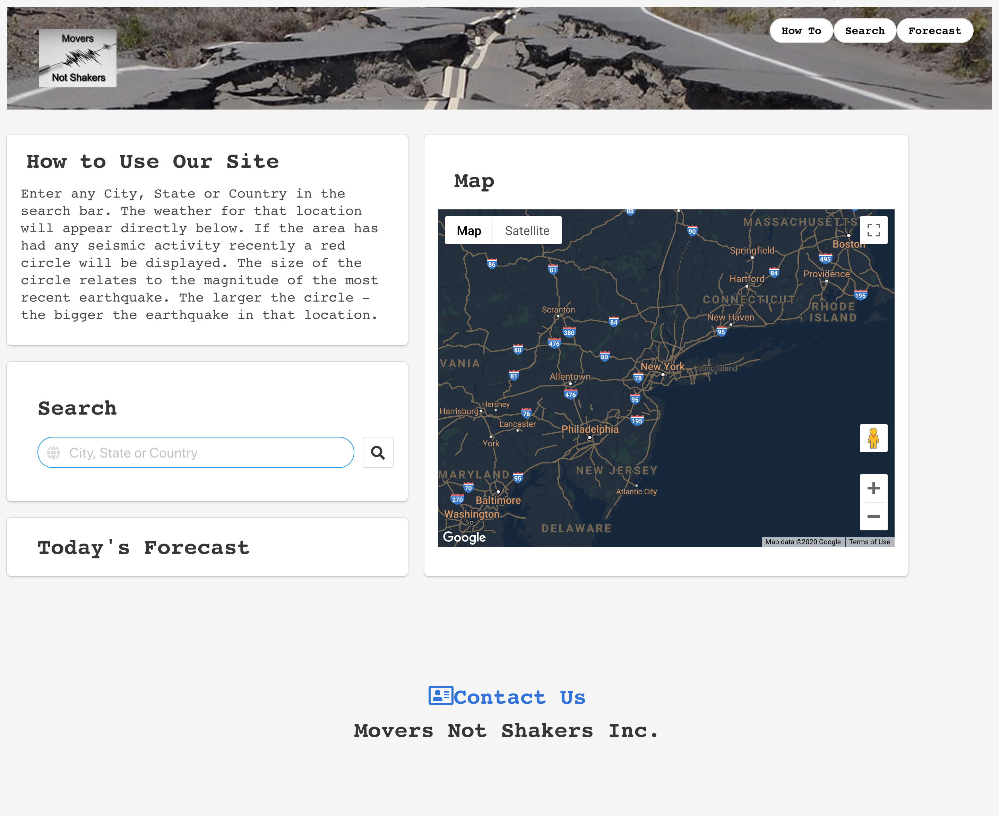
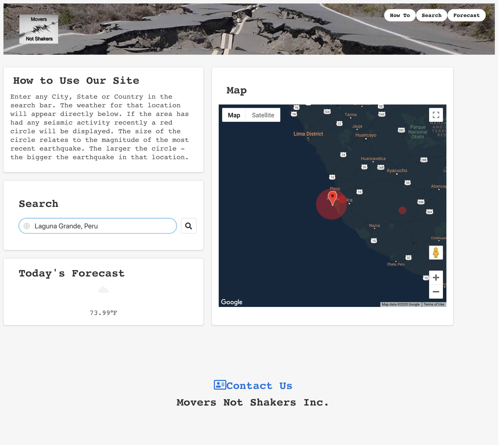
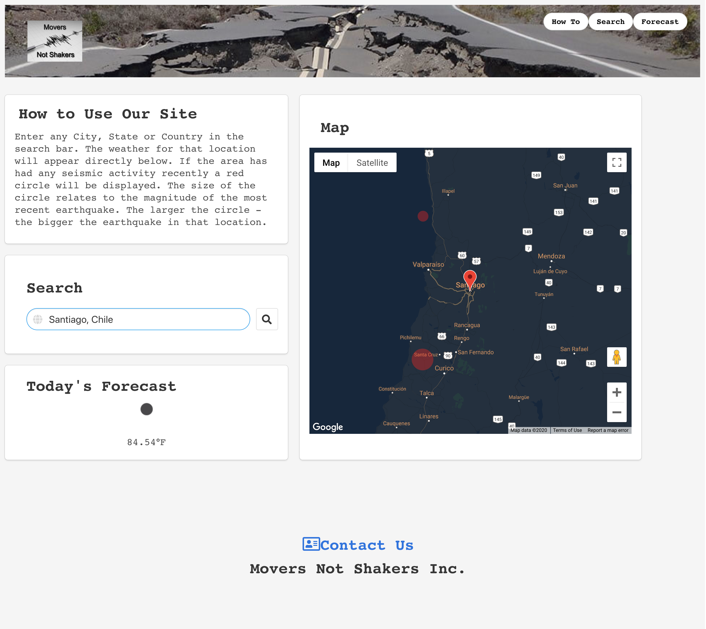
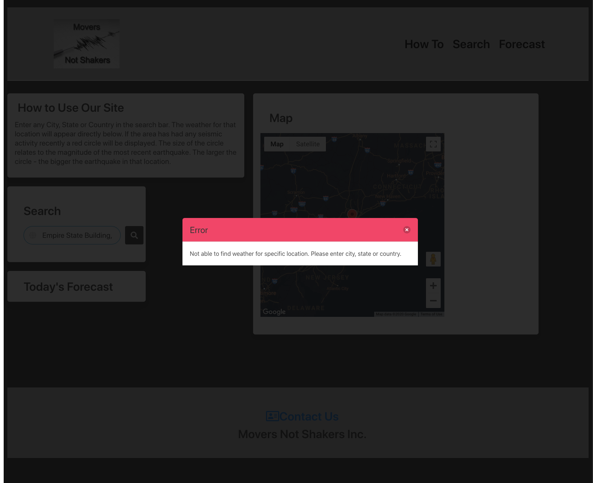

# Movers Not Shakers

## Purpose
A site to help users plan trips based on that location's seismic activity. Designed for users that want to travel worry-free. Users can search any location and see a map of the location with information about any recent seismic activity, as well as the current weather.

## Built With
* HTML
* CSS
* JavaScript
* jQuery
* Bulma
* Google Maps API
* OpenWeather API

## Website
https://jbeedle19.github.io/movers-not-shakers/

## Screenshots

## Contribution
Made with ❤️ by Maria Cannon, Matthew Crouse, and Joshua Beedle